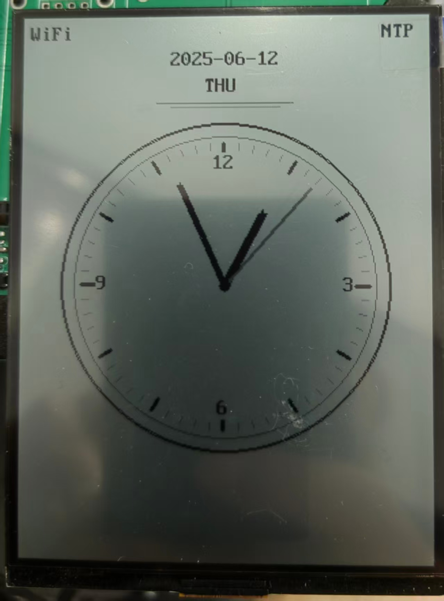
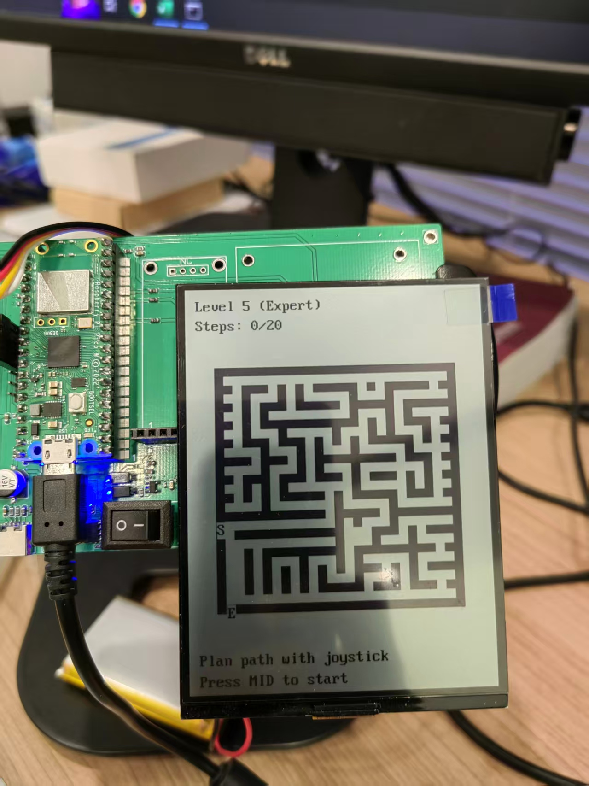

# ST73xx 反射式液晶显示驱动库

[](LICENSE)
[](https://www.raspberrypi.com/products/raspberry-pi-pico/)
[](https://github.com/musicaJack/ST7305_2.9_Reflective_Lcd/releases)

[English](README.md) | 中文

这是一个专为树莓派Pico设计的ST7305和ST7306反射式LCD显示屏的综合性高性能驱动库。该库提供了完整的图形框架，包含硬件抽象层、优化渲染引擎和易于使用的API接口。
<p align="center">
  
  
</p>
## ✨ 特性

- **多设备支持**：完整支持ST7305和ST7306反射式液晶显示控制器
- **图形框架**：完整的UI抽象层，采用Adafruit GFX风格的API
- **高级图形**：内置图形绘制功能，支持形状、线条、文本和复杂动画
- **模板设计**：现代C++模板架构，确保类型安全和高性能
- **硬件抽象**：硬件驱动与图形渲染的清晰分离
- **优化SPI**：高性能SPI通信，支持可配置参数
- **字体系统**：内置字体支持，可自定义布局和大小
- **颜色管理**：支持灰度和单色渲染模式
- **旋转支持**：显示旋转和坐标变换
- **电源管理**：低功耗和高功耗模式，提高能源效率

## 🏗️ 项目架构

项目采用现代模块化设计，具有清晰的关注点分离：

### 核心组件

- **硬件驱动** (`st7305_driver.cpp`, `st7306_driver.cpp`)：底层显示控制器实现
- **UI抽象层** (`st73xx_ui.cpp/hpp`)：硬件无关的图形接口 (Adafruit GFX风格)
- **图形引擎** (`pico_display_gfx.hpp/inl`)：基于模板的图形渲染引擎
- **字体系统** (`fonts/st73xx_font.cpp`)：全面的字体渲染，支持布局选项
- **示例程序** (`examples/`)：展示功能的综合演示应用

### 目录结构

```
├── src/                           # 源代码目录
│   ├── st7305_driver.cpp         # ST7305控制器驱动
│   ├── st7306_driver.cpp         # ST7306控制器驱动 (新增)
│   ├── st73xx_ui.cpp             # UI抽象层 (新增)
│   └── fonts/
│       └── st73xx_font.cpp       # 字体数据和渲染 (增强)
├── include/                       # 头文件目录
│   ├── st7305_driver.hpp         # ST7305驱动接口
│   ├── st7306_driver.hpp         # ST7306驱动接口 (新增)
│   ├── st73xx_ui.hpp             # UI抽象接口 (新增)
│   ├── pico_display_gfx.hpp      # 模板图形引擎 (新增)
│   ├── pico_display_gfx.inl      # 模板实现 (新增)
│   ├── st73xx_font.hpp           # 字体系统接口 (新增)
│   └── gfx_colors.hpp            # 颜色定义 (新增)
├── examples/                      # 示例应用
│   ├── st7305_demo.cpp           # ST7305综合演示 (增强)
│   └── st7306_demo.cpp           # ST7306演示 (新增)
├── build/                         # 构建输出目录
├── CMakeLists.txt                # CMake构建配置 (更新)
└── build_pico.bat                # Windows构建脚本
```

## 🚀 快速开始

### 硬件连接

#### ST7305显示屏连接
```
树莓派Pico              ST7305显示屏
+---------------+         +---------------+
|  GPIO18 (SCK) |-------->| SCK          |
|  GPIO19 (MOSI)|-------->| MOSI         |
|  GPIO17 (CS)  |-------->| CS           |
|  GPIO20 (DC)  |-------->| DC           |
|  GPIO15 (RST) |-------->| RST          |
|  3.3V         |-------->| VCC          |
|  GND          |-------->| GND          |
+---------------+         +---------------+
```

#### ST7306显示屏连接
```
树莓派Pico              ST7306显示屏
+---------------+         +---------------+
|  GPIO18 (SCK) |-------->| SCK          |
|  GPIO19 (MOSI)|-------->| MOSI         |
|  GPIO17 (CS)  |-------->| CS           |
|  GPIO20 (DC)  |-------->| DC           |
|  GPIO15 (RST) |-------->| RST          |
|  3.3V         |-------->| VCC          |
|  GND          |-------->| GND          |
+---------------+         +---------------+
```

### 软件设置

1. **克隆仓库：**
```bash
git clone https://github.com/musicaJack/ST73XX_Reflective_Lcd.git
cd ST73XX_Reflective_Lcd
```

2. **构建项目：**
```bash
# Windows
./build_pico.bat

# Linux/Mac
mkdir build && cd build
cmake ..
make
```

## 📝 API使用指南

### 基本设置（模板方式）

```cpp
#include "st7305_driver.hpp"  // 或 "st7306_driver.hpp"
#include "pico_display_gfx.hpp"

// 硬件引脚定义
#define PIN_DC   20
#define PIN_RST  15
#define PIN_CS   17
#define PIN_SCLK 18
#define PIN_SDIN 19

// 初始化显示驱动
st7305::ST7305Driver display(PIN_DC, PIN_RST, PIN_CS, PIN_SCLK, PIN_SDIN);

// 创建图形上下文
pico_gfx::PicoDisplayGFX<st7305::ST7305Driver> gfx(
    display, 
    st7305::ST7305Driver::LCD_WIDTH, 
    st7305::ST7305Driver::LCD_HEIGHT
);

// 初始化
display.initialize();
```

### 图形操作

```cpp
// 清屏和基本操作
display.clearDisplay();
gfx.fillScreen(WHITE);

// 绘制基本图形
gfx.drawPixel(x, y, BLACK);
gfx.drawLine(10, 10, 100, 10, BLACK);
gfx.drawRectangle(20, 20, 50, 30, BLACK);
gfx.drawFilledRectangle(30, 30, 40, 20, BLACK);
gfx.drawCircle(60, 60, 15, BLACK);
gfx.drawFilledCircle(80, 80, 20, BLACK);
gfx.drawTriangle(10, 10, 50, 10, 30, 40, BLACK);

// 文本渲染
display.drawString(10, 10, "你好世界!", BLACK);
display.drawChar(x, y, 'A', BLACK);

// 显示旋转
gfx.setRotation(1);  // 0: 0°, 1: 90°, 2: 180°, 3: 270°
display.setRotation(1);

// 更新显示
display.display();
```

### 高级功能

```cpp
// ST7306灰度支持（4级）
st7306::ST7306Driver display306(/*引脚*/);
display306.drawPixelGray(x, y, st7306::ST7306Driver::COLOR_GRAY1);
display306.drawPixelGray(x, y, st7306::ST7306Driver::COLOR_GRAY2);

// 字体布局配置
display.setFontLayout(st7306::FontLayout::Horizontal);
display.setFontLayout(st7306::FontLayout::Vertical);

// 电源管理
display.lowPowerMode();
display.highPowerMode();
display.displaySleep(true);
display.displayOn(false);
```

### 高级图形示例

```cpp
// 复杂动画示例
void windmillAnimation() {
    const int CENTER_X = gfx.width() / 2;
    const int CENTER_Y = gfx.height() / 2;
    const int BLADE_COUNT = 3;
    const int BLADE_LENGTH = 60;
    
    for (float angle = 0; angle < 2 * M_PI; angle += 0.1) {
        gfx.fillScreen(WHITE);
        
        // 绘制风车叶片
        for (int i = 0; i < BLADE_COUNT; i++) {
            float blade_angle = angle + (i * 2 * M_PI / BLADE_COUNT);
            int end_x = CENTER_X + BLADE_LENGTH * cos(blade_angle);
            int end_y = CENTER_Y + BLADE_LENGTH * sin(blade_angle);
            
            gfx.drawLine(CENTER_X, CENTER_Y, end_x, end_y, BLACK);
        }
        
        // 绘制中心轮毂
        gfx.drawFilledCircle(CENTER_X, CENTER_Y, 5, BLACK);
        
        display.display();
        sleep_ms(50);
    }
}
```

## 🆕 版本2.0新特性

### 主要增强功能

1. **ST7306支持**：新增对ST7306控制器的完整支持，包含4级灰度显示
2. **UI抽象层**：受Adafruit GFX启发的全新硬件无关图形接口
3. **模板架构**：现代C++模板设计，提供更好的性能和类型安全性
4. **增强字体系统**：改进的字体渲染，支持布局选项和更好的性能
5. **高级图形**：复杂形状绘制、多边形支持和动画能力
6. **双目标构建**：支持同时构建ST7305和ST7306示例

### API改进

- **统一接口**：不同显示控制器间的一致API
- **更好的命名**：更直观的函数名称和一致的参数顺序
- **增强文档**：全面的内联文档和示例
- **错误处理**：改进的错误检查和验证

### 性能优化

- **优化SPI**：更快的通信，减少开销
- **内存效率**：更好的缓冲区管理和减少内存占用
- **渲染速度**：优化的绘制算法，实现更快的更新

## 🔧 构建目标

项目现在支持多个构建目标：

- `ST7305_Display`：ST7305演示应用程序
- `ST7306_Display`：ST7306演示应用程序
- `st7306_fullscreen_text_demo`：ST7306满屏文字显示演示（792字符，22行）
- `AnalogClockWiFi`：支持WiFi的NTP时钟
- `MazeGame`：交互式迷宫游戏演示

每个目标都包含展示相应控制器功能的综合示例。

## 📊 ST7306 满屏文字显示

### 技术规格

ST7306反射式LCD显示器通过优化的边界配置实现了更高的文字密度：

#### 硬件参数
- **物理分辨率**: 300×400像素
- **缓冲区大小**: 150×200字节（30KB）
- **像素存储方式**: 每个字节存储4个像素（2×2像素块）
- **灰度支持**: 4级灰度（0-3）
- **显示类型**: 反射式LCD，无需背光

#### 字体规格
- **字体大小**: 8×16像素
- **行间距**: 18像素（16像素字体 + 2像素间距）
- **字符间距**: 0像素（字符间无额外间距）

#### 字符容量计算

**水平方向字符数量:**
```
可用宽度 = LCD_WIDTH - 边距 = 300 - 10 = 290像素
每字符宽度 = 8像素
最大字符数 = 290 ÷ 8 = 36.25 → 36个字符/行
```

**垂直方向行数:**
```
可用高度 = LCD_HEIGHT - 边距 = 400 - 10 = 390像素
每行高度 = 18像素（16像素字体 + 2像素间距）
最大行数 = 390 ÷ 18 = 21.67 → 22行（极限）
```

**总字符容量:**
```
标准配置: 36 × 21 = 756个字符
极限配置: 36 × 22 = 792个字符
```

#### writePointGray的灰度优势

**灰度级别:**
- **0级**: 完全透明/白色
- **1级**: 浅灰色
- **2级**: 深灰色
- **3级**: 完全黑色

**字符显示效果:**
- 每个字符的8×16像素都可以独立设置4级灰度
- 可以实现更丰富的文字渲染效果
- 支持抗锯齿和字体平滑

#### 边界优化

**原始边界检查:**
```cpp
if (y + font::FONT_HEIGHT <= LCD_HEIGHT - MARGIN)
```

**优化边界检查:**
```cpp
if (y + font::FONT_HEIGHT <= LCD_HEIGHT)
```

**效果**: 允许第22行显示，增加36个字符容量

#### 性能指标

| 配置方案 | 字符数 | 显示效率 | 视觉效果 | 适用场景 |
|----------|--------|----------|----------|----------|
| 21行标准 | 756字符 | 94.5% | 完美对齐 | 正式文档 |
| 22行极限 | 792字符 | 99.0% | 轻微超出 | 信息密集 |


#### 技术参数总结

| 参数 | 数值 | 说明 |
|------|------|------|
| 屏幕分辨率 | 300×400像素 | 物理分辨率 |
| 缓冲区大小 | 30KB | 150×200字节 |
| 灰度级别 | 4级 | 0-3级灰度 |
| 字体大小 | 8×16像素 | 标准字体 |
| 最大字符数 | 792字符 | 22行×36字符 |
| 显示效率 | 99.0% | 空间利用率 |
| 字符密度 | 6.6字符/cm² | 信息密度 |

## 📊 ST7306 屏幕技术规格汇总

### 🔧 基础硬件参数

| 参数 | 数值 | 说明 |
|------|------|------|
| 屏幕分辨率 | 300×400像素 | 宽度×高度 |
| 显示类型 | 反射式LCD | 无需背光，环境光显示 |
| 灰度级别 | 4级 | 0x00(白) → 0x01(浅灰) → 0x02(深灰) → 0x03(黑) |
| 像素存储 | 2位/像素 | 4像素打包为1字节 |
| 显示缓冲区 | 37.5KB | 300×400×2位÷8位 |

### 🔤 字体显示参数

| 参数 | 数值 | 说明 |
|------|------|------|
| 字体尺寸 | 8×16像素 | 宽度×高度 |
| 字符间距 | 0像素 | 字符间无额外间距 |
| 行间距 | 2像素 | 行与行之间的间距 |
| 总行高 | 18像素 | 字体高度(16) + 行间距(2) |

### 📐 布局配置参数

| 配置类型 | 边距 | 行间距 | 每行字符数 | 最大行数 | 总字符数 |
|----------|------|--------|------------|----------|----------|
| 标准配置 | 5像素 | 2像素 | 36字符 | 21行 | 756字符 |
| 极限配置 | 5像素 | 2像素 | 36字符 | 22行 | 792字符 |
| 无边距配置 | 0像素 | 0像素 | 37字符 | 22行 | 814字符 |

### 📊 详细计算分析

| 计算项目 | 公式 | 结果 | 说明 |
|----------|------|------|------|
| 可用宽度 | 300 - 2×5 = 290像素 | 290像素 | 屏幕宽度减去左右边距 |
| 每行字符数 | 290 ÷ 8 = 36.25 | 36字符 | 向下取整 |
| 可用高度(21行) | 400 - 2×5 = 390像素 | 390像素 | 屏幕高度减去上下边距 |
| 21行所需高度 | 21 × 18 = 378像素 | 378像素 | 21行总高度 |
| 可用高度(22行) | 400像素 | 400像素 | 允许超出边距 |
| 22行所需高度 | 22 × 18 = 396像素 | 396像素 | 22行总高度 |
| 22行底部位置 | 5 + 21×18 + 16 = 399像素 | 399像素 | 第22行文字底部 |

### 🎯 显示效果对比

| 配置方案 | 字符数 | 显示效率 | 视觉效果 | 适用场景 |
|----------|--------|----------|----------|----------|
| 21行标准 | 756字符 | 94.5% | 完美对齐 | 正式文档 |
| 22行极限 | 792字符 | 99.0% | 轻微超出 | 信息密集 |
| 无边距极限 | 814字符 | 101.8% | 完全填满 | 测试用途 |

### 🔧 边界检查逻辑

| 检查类型 | 原始逻辑 | 优化逻辑 | 效果 |
|----------|----------|----------|------|
| 边界条件 | y + 16 ≤ 395 | y + 16 ≤ 400 | 允许第22行显示 |
| 第22行Y坐标 | 383像素 | 383像素 | 不变 |
| 第22行底部 | 399像素 | 399像素 | 不变 |
| 边界限制 | 395像素 | 400像素 | 放宽5像素 |
| 显示结果 | 第22行被拦截 | 第22行正常显示 | ✅ 成功 |

### ⚡ 性能指标

| 指标 | 数值 | 单位 | 说明 |
|------|------|------|------|
| 字符密度 | 6.6 | 字符/cm² | 每平方厘米字符数 |
| 信息密度 | 792 | 字符/屏 | 单屏最大字符数 |
| 显示效率 | 99.0% | - | 22行配置下的空间利用率 |
| 刷新率 | 取决于SPI | Hz | 由SPI时钟频率决定 |
| 功耗 | 极低 | mW | 反射式LCD，无背光 |

### 🎨 实际应用建议

| 应用类型 | 推荐配置 | 字符数 | 优势 |
|----------|----------|--------|------|
| 文档阅读 | 21行标准 | 756字符 | 视觉舒适，边距合理 |
| 信息显示 | 22行极限 | 792字符 | 信息密度最高 |
| 系统监控 | 22行极限 | 792字符 | 显示更多状态信息 |
| 测试验证 | 无边距极限 | 814字符 | 验证硬件极限 |

## 🐛 故障排除

### 常见问题

1. **显示不工作：**
   - 验证电源供应稳定在3.3V
   - 检查所有引脚连接
   - 确保SPI配置与您的硬件匹配

2. **显示质量差：**
   - 检查初始化序列
   - 验证显示区域配置
   - 确认像素写入逻辑

3. **性能问题：**
   - 在适当时使用低功耗模式
   - 优化SPI时钟速度
   - 在不使用显示时启用睡眠模式

## 🤝 贡献

我们欢迎贡献！请确保您的提交：

1. 遵循现有的代码风格和约定
2. 包含全面的文档和注释
3. 添加适当的测试覆盖
4. 更新相关文档

## 📄 许可证

本项目采用MIT许可证。详见[LICENSE](LICENSE)文件。

## 📧 联系方式

如有问题、建议或需要支持：

- **邮箱**：yinyue@beingdigital.cn
- **问题反馈**：[GitHub Issues](https://github.com/musicaJack/ST7305_2.9_Reflective_Lcd/issues)

## 🙏 致谢

特别感谢所有为改进这个库并使其更易于创客社区使用而贡献力量的人。

## 硬件配置

### SPI引脚配置
SPI引脚配置已集中在 `include/spi_config.hpp` 文件中。您可以根据您的硬件设置修改这些引脚：

```cpp
#define SPI_PORT spi0
#define PIN_DC   20
#define PIN_RST  15
#define PIN_CS   17
#define PIN_SCLK 18
#define PIN_SDIN 19
```

## 功能分类

### 核心功能
这些是经过充分测试并在示例中广泛使用的常用功能：

#### 显示控制
- `clearDisplay()` - 清除显示缓冲区
- `display()` - 更新物理显示
- `displayOn()` - 开启/关闭显示
- `displaySleep()` - 设置显示睡眠模式
- `displayInversion()` - 设置显示反转模式

#### 基础绘图
- `drawPixel()` / `drawPixelGray()` - 绘制单个像素
- `drawLine()` - 绘制直线
- `drawCircle()` / `drawFilledCircle()` - 绘制圆形
- `drawString()` / `drawChar()` - 绘制文字

### 扩展功能
这些功能虽然可用，但在当前示例中未被广泛使用。它们为未来扩展提供了可能：

#### 高级图形
- `drawTriangle()` / `drawFilledTriangle()` - 绘制三角形
- `drawPolygon()` / `drawFilledPolygon()` - 绘制多边形
- `drawRectangle()` / `drawFilledRectangle()` - 绘制矩形

### 示例分类

#### 基础示例
- `st7305_demo.cpp` - ST7305基础绘图演示
- `st7306_demo.cpp` - ST7306基础绘图演示

#### 网络示例
- `analog_clock_wifi.cpp` - 支持WiFi的NTP时钟

#### 游戏示例
- `maze_game.cpp` - 带摇杆控制的交互式迷宫游戏

## 迷宫游戏示例

### 游戏概述
这是一个基于ST7306显示屏和joystick控制器的迷宫游戏。玩家需要预先规划路径，然后观看小人按照规划的路径在迷宫中移动。

### 硬件要求
- 树莓派Pico开发板
- ST7306反射式LCD显示屏
- Joystick控制器（I2C接口）

### 硬件连接

#### ST7306显示屏连接
```
树莓派Pico              ST7306显示屏
+---------------+         +---------------+
|  GPIO18 (SCK) |-------->| SCK          |
|  GPIO19 (MOSI)|-------->| MOSI         |
|  GPIO17 (CS)  |-------->| CS           |
|  GPIO20 (DC)  |-------->| DC           |
|  GPIO15 (RST) |-------->| RST          |
|  3.3V         |-------->| VCC          |
|  GND          |-------->| GND          |
+---------------+         +---------------+
```

#### Joystick连接
```
树莓派Pico              Joystick
+---------------+         +---------------+
|  GPIO6 (SDA)  |-------->| SDA          |
|  GPIO7 (SCL)  |-------->| SCL          |
|  3.3V         |-------->| VCC          |
|  GND          |-------->| GND          |
+---------------+         +---------------+
```

### 游戏规则
1. **迷宫生成**：游戏开始时会自动生成一个随机迷宫
2. **路径规划**：使用joystick的方向控制（上、下、左、右）来预先规划小人的移动路径
3. **开始游戏**：按下joystick的中间按钮（MID键）开始执行规划的路径
4. **移动反馈**：小人每走一步，joystick上的蓝色LED会闪烁一次
5. **胜利条件**：小人按照规划路径成功到达迷宫出口，绿色LED闪烁3秒
6. **失败条件**：小人撞墙或路径用完但未到达出口，红色LED闪烁3秒

### 操作说明

#### 路径规划阶段
- **上/下/左/右**：添加对应方向的移动指令到路径中
- **MID键**：开始执行规划的路径（需要至少规划一步）

#### 游戏运行阶段
- 小人会按照规划的路径自动移动
- 每500ms执行一步移动
- 屏幕会显示当前执行的步骤

#### 游戏结束阶段
- **胜利**：显示"YOU WIN!"，joystick LED变绿
- **失败**：显示"YOU LOST!"，joystick LED变红
- **MID键**：重新开始新游戏

### 显示说明
- **黑色方块**：墙壁（不可通过）
- **白色区域**：通路（可以通过）
- **浅灰色**：起点位置
- **深灰色**：终点位置
- **黑色小点**：小人当前位置（游戏运行时）

### LED指示
- **绿色**：joystick初始化成功（亮1秒后关闭）
- **蓝色**：检测到操作（方向输入或按钮按下）
- **蓝色闪烁**：小人每走一步时闪烁一次
- **绿色闪烁3秒**：成功走出迷宫
- **红色闪烁3秒**：游戏失败（撞墙或未到达终点）
- **关闭**：无操作状态或操作结束后

### 技术特性
- **迷宫生成算法**：递归回溯算法生成随机迷宫
- **路径验证**：BFS算法确保迷宫有解
- **输入防抖**：300ms防抖时间避免误触
- **视觉反馈**：LED颜色变化和屏幕显示提供实时反馈
- **错误处理**：自动处理无效移动和边界检查

### 故障排除
1. **显示屏无显示**：检查SPI连接和电源
2. **Joystick无响应**：检查I2C连接和地址配置
3. **游戏卡死**：重启设备，检查串口输出的错误信息
4. **路径检测不准确**：调整joystick的阈值参数 

## 📚 附加文档

### 🎮 迷宫游戏更新说明

#### 版本 2.5.0 更新内容

##### 经典递归回溯算法 ⭐
- **用户反馈**: 根据用户建议，还原到前面版本的经典迷宫生成算法
- **算法特点**: 使用递归回溯算法生成传统迷宫结构
- **迷宫质量**: 生成具有经典迷宫特征的布局，有更好的迷宫感
- **保留改进**: 维持步数验证和边界检查等技术改进

##### 保留的技术改进
- **步数验证**: 保留BFS验证机制，确保迷宫符合难度要求
- **多次尝试**: 最多尝试20次生成符合要求的迷宫
- **边界检查**: 保留所有边界检查，确保无编译警告
- **备用方案**: 如果递归回溯失败，使用简单路径作为备用

##### 递归回溯算法
```
1. 从起点开始，标记为已访问
2. 随机选择一个未访问的邻居（间隔2格）
3. 移除当前位置和邻居之间的墙壁
4. 递归访问邻居
5. 如果没有未访问邻居，回溯到上一个位置
6. 重复直到所有可达位置都被访问
```

##### 算法优势
- **经典结构**: 生成传统迷宫的分支和死胡同结构
- **随机性**: 每次生成不同的迷宫布局
- **连通性**: 确保从起点到终点有路径
- **挑战性**: 提供真正的迷宫探索体验

##### 技术实现

###### 核心函数
- `generateMaze()`: 主迷宫生成器，包含验证逻辑
- `generateBasicMaze()`: 递归回溯迷宫生成
- `getUnvisitedNeighbors()`: 获取未访问的邻居节点
- `validateMazeSteps()`: BFS步数验证算法
- `generateOptimizedMaze()`: 简单路径备用方案
- `addEntranceExits()`: 入口出口开口生成

###### 保留的改进
- **无编译警告**: 所有数组访问都有边界检查
- **步数精确**: 确保生成的迷宫符合难度步数要求
- **多次尝试**: 提高生成符合要求迷宫的成功率
- **智能备用**: 递归回溯失败时有简单路径保底

##### 迷宫特点

###### Level 5 (20步，27x27迷宫)
- **经典结构**: 传统递归回溯算法生成的迷宫布局
- **分支路径**: 包含多个分支和死胡同
- **探索性**: 需要策略思考和路径规划
- **挑战性**: 在20步限制内找到最优路径

##### 调试设置

当前设置为Level 5 (最高难度):
```cpp
#define DIFFICULTY_LEVEL 5  // 当前难度级别
```

各难度级别设置：
- **Level 1**: 5步，11x11迷宫
- **Level 2**: 8步，15x15迷宫  
- **Level 3**: 12步，19x19迷宫
- **Level 4**: 15步，23x23迷宫
- **Level 5**: 20步，27x27迷宫 ✅ **当前设置**

##### 调试信息

游戏启动时会在串口输出信息：
```
Attempt 1: Maze requires too many steps, regenerating...
Attempt 3: Maze requires minimum 19 steps (limit: 20)
Generated valid maze in 3 attempts
```

或者使用备用方案：
```
Failed to generate random maze, creating optimized maze
Generated optimized maze targeting 20 steps
```

### 🌏 中文字体渲染 API

这是一个为 ST73xx 系列 LCD 显示器设计的中文字体渲染库，提供了模板化、可扩展的字体渲染解决方案。

#### 特性

- 🎯 **模板化设计**：支持不同的显示驱动
- 🌏 **UTF-8 支持**：完整的中英文混合文本渲染
- 🔧 **可扩展架构**：支持多种字体数据源
- 🛡️ **错误处理**：健壮的错误检查和恢复机制
- 📊 **调试支持**：内置字符点阵调试功能

#### 文件结构

```
include/
├── st73xx_font_cn.hpp      # 主头文件
└── st73xx_font_cn.inl      # 内联实现

src/
└── st73xx_font_cn.cpp      # 工具函数实现

examples/
└── chinese_font_test.cpp   # 综合测试文件
```

#### 快速开始

##### 基本使用

```cpp
#include "st7306_driver.hpp"
#include "st73xx_font_cn.hpp"

int main() {
    // 创建字体管理器
    st73xx_font_cn::FontManager<st7306::ST7306Driver> font_mgr;
    
    // 初始化字体数据
    const uint8_t* font_data = (const uint8_t*)st73xx_font_cn::DEFAULT_FONT_ADDRESS;
    font_mgr.initialize(font_data);
    
    // 初始化显示驱动
    st7306::ST7306Driver lcd(PIN_DC, PIN_RST, PIN_CS, PIN_SCLK, PIN_SDIN);
    lcd.initialize();
    
    // 绘制文本
    font_mgr.draw_string(lcd, 10, 10, "Hello World", true);
    font_mgr.draw_string(lcd, 10, 30, "你好世界", true);
    lcd.display();
    
    return 0;
}
```

##### 高级使用

```cpp
// 使用自定义字体数据源
st73xx_font_cn::FlashFontDataSource font_source(custom_font_data);
st73xx_font_cn::FontRenderer16x16<st7306::ST7306Driver> renderer(&font_source);

// 绘制单个字符
renderer.draw_char(lcd, 10, 10, 'A', true);
renderer.draw_char(lcd, 30, 10, 0x4E2D, true);  // "中"
```

#### API 参考

##### FontManager 类

主要的字体管理类，提供简化的接口。

###### 构造函数
```cpp
FontManager(const uint8_t* font_data = nullptr)
```

###### 方法
- `bool initialize(const uint8_t* font_data = nullptr)` - 初始化字体
- `bool verify_font() const` - 验证字体数据
- `void draw_char(DisplayDriver& display, int x, int y, uint32_t char_code, bool color)` - 绘制单个字符
- `void draw_string(DisplayDriver& display, int x, int y, const char* str, bool color)` - 绘制字符串
- `uint16_t get_font_version() const` - 获取字体版本
- `uint16_t get_total_chars() const` - 获取字符总数
- `void print_char_bitmap(uint32_t char_code) const` - 打印字符点阵（调试用）

##### IFontDataSource 接口

字体数据源接口，可以扩展支持不同的数据源。

###### 纯虚函数
- `const uint8_t* get_char_bitmap(uint32_t char_code) const` - 获取字符点阵
- `bool verify_header() const` - 验证文件头
- `uint16_t get_version() const` - 获取版本号
- `uint16_t get_total_chars() const` - 获取字符总数

##### FlashFontDataSource 类

Flash 内存字体数据源实现。

###### 构造函数
```cpp
FlashFontDataSource(const uint8_t* font_data = nullptr)
```

###### 方法
- `void set_font_data(const uint8_t* font_data)` - 设置字体数据地址

##### IFontRenderer 接口

字体渲染器接口，支持不同的渲染算法。

###### 纯虚函数
- `void draw_char(DisplayDriver& display, int x, int y, uint32_t char_code, bool color)` - 绘制字符
- `void draw_string(DisplayDriver& display, int x, int y, const char* str, bool color)` - 绘制字符串

##### FontRenderer16x16 类

16x16 像素字体渲染器实现。

###### 构造函数
```cpp
FontRenderer16x16(const IFontDataSource* font_source = nullptr)
```

###### 方法
- `void set_font_source(const IFontDataSource* font_source)` - 设置字体数据源
- `const IFontDataSource* get_font_source() const` - 获取字体数据源

#### 支持的字符类型

- **ASCII 字符** (0x20-0x7E): 95个字符，包含空格
- **全角标点符号** (0x3000-0x303F): 64个字符
- **全角字符** (0xFF00-0xFFEF): 240个字符
- **中文字符** (0x4E00-0x9FA5): 28,648个字符

#### 字体文件格式

字体文件应包含以下结构：
- 文件头 (4字节): 版本号(2字节) + 字符总数(2字节)
- 字符数据: 每个字符32字节 (16x16像素)

#### 编译配置

在 CMakeLists.txt 中添加：

```cmake
# 添加源文件
add_executable(YourApp
    your_main.cpp
    src/st7306_driver.cpp
    src/st73xx_font_cn.cpp
)

# 添加包含目录
target_include_directories(YourApp PRIVATE
    ${CMAKE_CURRENT_LIST_DIR}/include
)

# 链接库
target_link_libraries(YourApp PUBLIC
    pico_stdlib
    hardware_spi
    hardware_gpio
    pico_stdio_usb
)
```

#### 错误处理

API 提供了完善的错误处理机制：

```cpp
// 检查字体初始化
if (!font_mgr.initialize(font_data)) {
    printf("Font initialization failed!\n");
    return -1;
}

// 验证字体数据
if (!font_mgr.verify_font()) {
    printf("Font verification failed!\n");
    return -1;
}

// 安全的绘制调用（即使字体未初始化也不会崩溃）
font_mgr.draw_string(lcd, 10, 10, "Test", true);
```

#### 调试功能

```cpp
// 打印字体信息
printf("Font Version: %d\n", font_mgr.get_font_version());
printf("Total Characters: %d\n", font_mgr.get_total_chars());

// 打印字符点阵
font_mgr.print_char_bitmap('A');
font_mgr.print_char_bitmap(0x4E2D);  // "中"
```

#### 扩展性

##### 添加新的字体数据源

```cpp
class SDCardFontDataSource : public IFontDataSource {
public:
    const uint8_t* get_char_bitmap(uint32_t char_code) const override {
        // 从SD卡读取字体数据
        return read_from_sd_card(char_code);
    }
    
    bool verify_header() const override {
        // 验证SD卡上的字体文件
        return verify_sd_font_file();
    }
    
    // ... 其他方法实现
};
```

##### 添加新的渲染器

```cpp
template<typename DisplayDriver>
class FontRenderer24x24 : public IFontRenderer<DisplayDriver> {
public:
    void draw_char(DisplayDriver& display, int x, int y, uint32_t char_code, bool color) override {
        // 24x24像素渲染实现
    }
    
    void draw_string(DisplayDriver& display, int x, int y, const char* str, bool color) override {
        // 字符串渲染实现
    }
};
```

#### 示例程序

- `chinese_font_test.cpp`: 综合测试程序

#### 注意事项

1. 确保字体文件已正确加载到 Flash 地址 0x10100000
2. 字体文件格式必须符合规范
3. 显示驱动必须实现 `drawPixel(x, y, color)` 方法
4. UTF-8 编码的字符串会自动解码

## 📄 许可证

本项目采用 MIT 许可证 - 详情请参阅 [LICENSE](LICENSE) 文件。

## 🤝 贡献

欢迎贡献！请随时提交 Pull Request。

## 📞 支持

如果您遇到任何问题或有疑问，请在 GitHub 上提交 issue。 