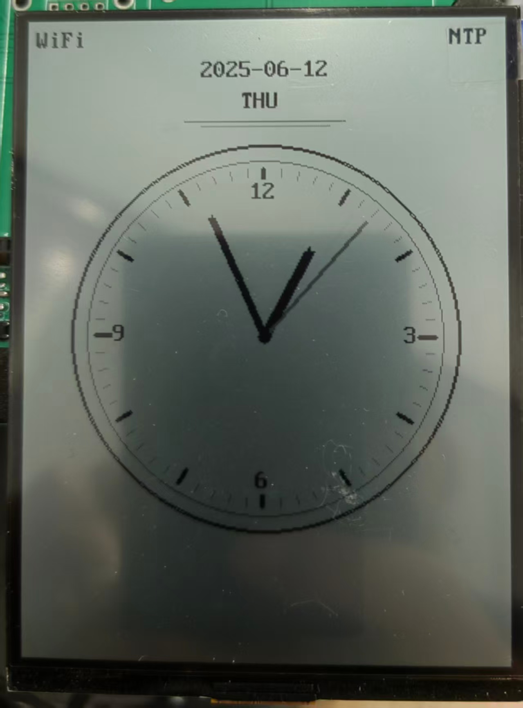
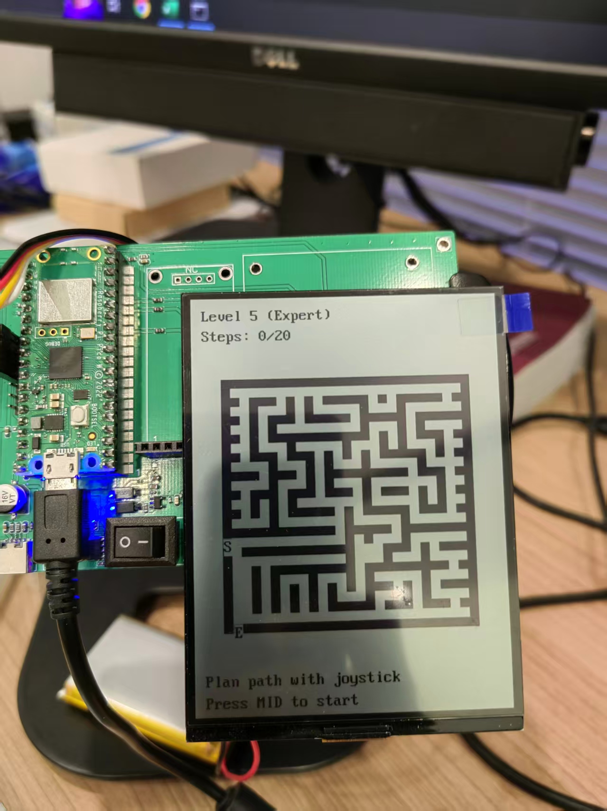

# ST73xx 反射式液晶显示驱动库

[](LICENSE)
[](https://www.raspberrypi.com/products/raspberry-pi-pico/)
[](https://github.com/musicaJack/ST7305_2.9_Reflective_Lcd/releases)

[English](README.md) | 中文

这是一个专为树莓派Pico设计的ST7305和ST7306反射式LCD显示屏的综合性高性能驱动库。该库提供了完整的图形框架，包含硬件抽象层、优化渲染引擎和易于使用的API接口。


## ✨ 特性

- **多设备支持**：完整支持ST7305和ST7306反射式液晶显示控制器
- **图形框架**：完整的UI抽象层，采用Adafruit GFX风格的API
- **高级图形**：内置图形绘制功能，支持形状、线条、文本和复杂动画
- **模板设计**：现代C++模板架构，确保类型安全和高性能
- **硬件抽象**：硬件驱动与图形渲染的清晰分离
- **优化SPI**：高性能SPI通信，支持可配置参数
- **字体系统**：内置字体支持，可自定义布局和大小
- **颜色管理**：支持灰度和单色渲染模式
- **旋转支持**：显示旋转和坐标变换
- **电源管理**：低功耗和高功耗模式，提高能源效率

## 🏗️ 项目架构

项目采用现代模块化设计，具有清晰的关注点分离：

### 核心组件

- **硬件驱动** (`st7305_driver.cpp`, `st7306_driver.cpp`)：底层显示控制器实现
- **UI抽象层** (`st73xx_ui.cpp/hpp`)：硬件无关的图形接口 (Adafruit GFX风格)
- **图形引擎** (`pico_display_gfx.hpp/inl`)：基于模板的图形渲染引擎
- **字体系统** (`fonts/st73xx_font.cpp`)：全面的字体渲染，支持布局选项
- **示例程序** (`examples/`)：展示功能的综合演示应用

### 目录结构

```
├── src/                           # 源代码目录
│   ├── st7305_driver.cpp         # ST7305控制器驱动
│   ├── st7306_driver.cpp         # ST7306控制器驱动 (新增)
│   ├── st73xx_ui.cpp             # UI抽象层 (新增)
│   └── fonts/
│       └── st73xx_font.cpp       # 字体数据和渲染 (增强)
├── include/                       # 头文件目录
│   ├── st7305_driver.hpp         # ST7305驱动接口
│   ├── st7306_driver.hpp         # ST7306驱动接口 (新增)
│   ├── st73xx_ui.hpp             # UI抽象接口 (新增)
│   ├── pico_display_gfx.hpp      # 模板图形引擎 (新增)
│   ├── pico_display_gfx.inl      # 模板实现 (新增)
│   ├── st73xx_font.hpp           # 字体系统接口 (新增)
│   └── gfx_colors.hpp            # 颜色定义 (新增)
├── examples/                      # 示例应用
│   ├── st7305_demo.cpp           # ST7305综合演示 (增强)
│   └── st7306_demo.cpp           # ST7306演示 (新增)
├── build/                         # 构建输出目录
├── CMakeLists.txt                # CMake构建配置 (更新)
└── build_pico.bat                # Windows构建脚本
```

## 🚀 快速开始

### 硬件连接

#### ST7305显示屏连接
```
树莓派Pico              ST7305显示屏
+---------------+         +---------------+
|  GPIO18 (SCK) |-------->| SCK          |
|  GPIO19 (MOSI)|-------->| MOSI         |
|  GPIO17 (CS)  |-------->| CS           |
|  GPIO20 (DC)  |-------->| DC           |
|  GPIO15 (RST) |-------->| RST          |
|  3.3V         |-------->| VCC          |
|  GND          |-------->| GND          |
+---------------+         +---------------+
```

#### ST7306显示屏连接
```
树莓派Pico              ST7306显示屏
+---------------+         +---------------+
|  GPIO18 (SCK) |-------->| SCK          |
|  GPIO19 (MOSI)|-------->| MOSI         |
|  GPIO17 (CS)  |-------->| CS           |
|  GPIO20 (DC)  |-------->| DC           |
|  GPIO15 (RST) |-------->| RST          |
|  3.3V         |-------->| VCC          |
|  GND          |-------->| GND          |
+---------------+         +---------------+
```

### 软件设置

1. **克隆仓库：**
```bash
git clone https://github.com/musicaJack/ST7305_2.9_Reflective_Lcd.git
cd ST7305_2.9_Reflective_Lcd
```

2. **构建项目：**
```bash
# Windows
./build_pico.bat

# Linux/Mac
mkdir build && cd build
cmake ..
make
```

## 📝 API使用指南

### 基本设置（模板方式）

```cpp
#include "st7305_driver.hpp"  // 或 "st7306_driver.hpp"
#include "pico_display_gfx.hpp"

// 硬件引脚定义
#define PIN_DC   20
#define PIN_RST  15
#define PIN_CS   17
#define PIN_SCLK 18
#define PIN_SDIN 19

// 初始化显示驱动
st7305::ST7305Driver display(PIN_DC, PIN_RST, PIN_CS, PIN_SCLK, PIN_SDIN);

// 创建图形上下文
pico_gfx::PicoDisplayGFX<st7305::ST7305Driver> gfx(
    display, 
    st7305::ST7305Driver::LCD_WIDTH, 
    st7305::ST7305Driver::LCD_HEIGHT
);

// 初始化
display.initialize();
```

### 图形操作

```cpp
// 清屏和基本操作
display.clearDisplay();
gfx.fillScreen(WHITE);

// 绘制基本图形
gfx.drawPixel(x, y, BLACK);
gfx.drawLine(10, 10, 100, 10, BLACK);
gfx.drawRectangle(20, 20, 50, 30, BLACK);
gfx.drawFilledRectangle(30, 30, 40, 20, BLACK);
gfx.drawCircle(60, 60, 15, BLACK);
gfx.drawFilledCircle(80, 80, 20, BLACK);
gfx.drawTriangle(10, 10, 50, 10, 30, 40, BLACK);

// 文本渲染
display.drawString(10, 10, "你好世界!", BLACK);
display.drawChar(x, y, 'A', BLACK);

// 显示旋转
gfx.setRotation(1);  // 0: 0°, 1: 90°, 2: 180°, 3: 270°
display.setRotation(1);

// 更新显示
display.display();
```

### 高级功能

```cpp
// ST7306灰度支持（4级）
st7306::ST7306Driver display306(/*引脚*/);
display306.drawPixelGray(x, y, st7306::ST7306Driver::COLOR_GRAY1);
display306.drawPixelGray(x, y, st7306::ST7306Driver::COLOR_GRAY2);

// 字体布局配置
display.setFontLayout(st7306::FontLayout::Horizontal);
display.setFontLayout(st7306::FontLayout::Vertical);

// 电源管理
display.lowPowerMode();
display.highPowerMode();
display.displaySleep(true);
display.displayOn(false);
```

### 高级图形示例

```cpp
// 复杂动画示例
void windmillAnimation() {
    const int CENTER_X = gfx.width() / 2;
    const int CENTER_Y = gfx.height() / 2;
    const int BLADE_COUNT = 3;
    const int BLADE_LENGTH = 60;
    
    for (float angle = 0; angle < 2 * M_PI; angle += 0.1) {
        gfx.fillScreen(WHITE);
        
        // 绘制风车叶片
        for (int i = 0; i < BLADE_COUNT; i++) {
            float blade_angle = angle + (i * 2 * M_PI / BLADE_COUNT);
            int end_x = CENTER_X + BLADE_LENGTH * cos(blade_angle);
            int end_y = CENTER_Y + BLADE_LENGTH * sin(blade_angle);
            
            gfx.drawLine(CENTER_X, CENTER_Y, end_x, end_y, BLACK);
        }
        
        // 绘制中心轮毂
        gfx.drawFilledCircle(CENTER_X, CENTER_Y, 5, BLACK);
        
        display.display();
        sleep_ms(50);
    }
}
```

## 🆕 版本2.0新特性

### 主要增强功能

1. **ST7306支持**：新增对ST7306控制器的完整支持，包含4级灰度显示
2. **UI抽象层**：受Adafruit GFX启发的全新硬件无关图形接口
3. **模板架构**：现代C++模板设计，提供更好的性能和类型安全性
4. **增强字体系统**：改进的字体渲染，支持布局选项和更好的性能
5. **高级图形**：复杂形状绘制、多边形支持和动画能力
6. **双目标构建**：支持同时构建ST7305和ST7306示例

### API改进

- **统一接口**：不同显示控制器间的一致API
- **更好的命名**：更直观的函数名称和一致的参数顺序
- **增强文档**：全面的内联文档和示例
- **错误处理**：改进的错误检查和验证

### 性能优化

- **优化SPI**：更快的通信，减少开销
- **内存效率**：更好的缓冲区管理和减少内存占用
- **渲染速度**：优化的绘制算法，实现更快的更新

## 🔧 构建目标

项目现在支持多个构建目标：

- `ST7305_Display`：ST7305演示应用程序
- `ST7306_Display`：ST7306演示应用程序

每个目标都包含展示相应控制器功能的综合示例。

## 🐛 故障排除

### 常见问题

1. **显示不工作：**
   - 验证电源供应稳定在3.3V
   - 检查所有引脚连接
   - 确保SPI配置与您的硬件匹配

2. **显示质量差：**
   - 检查初始化序列
   - 验证显示区域配置
   - 确认像素写入逻辑

3. **性能问题：**
   - 在适当时使用低功耗模式
   - 优化SPI时钟速度
   - 在不使用显示时启用睡眠模式

## 🤝 贡献

我们欢迎贡献！请确保您的提交：

1. 遵循现有的代码风格和约定
2. 包含全面的文档和注释
3. 添加适当的测试覆盖
4. 更新相关文档

## 📄 许可证

本项目采用MIT许可证。详见[LICENSE](LICENSE)文件。

## 📧 联系方式

如有问题、建议或需要支持：

- **邮箱**：yinyue@beingdigital.cn
- **问题反馈**：[GitHub Issues](https://github.com/musicaJack/ST7305_2.9_Reflective_Lcd/issues)

## 🙏 致谢

特别感谢所有为改进这个库并使其更易于创客社区使用而贡献力量的人。

## 硬件配置

### SPI引脚配置
SPI引脚配置已集中在 `include/spi_config.hpp` 文件中。您可以根据您的硬件设置修改这些引脚：

```cpp
#define SPI_PORT spi0
#define PIN_DC   20
#define PIN_RST  15
#define PIN_CS   17
#define PIN_SCLK 18
#define PIN_SDIN 19
```

## 功能分类

### 核心功能
这些是经过充分测试并在示例中广泛使用的常用功能：

#### 显示控制
- `clearDisplay()` - 清除显示缓冲区
- `display()` - 更新物理显示
- `displayOn()` - 开启/关闭显示
- `displaySleep()` - 设置显示睡眠模式
- `displayInversion()` - 设置显示反转模式

#### 基础绘图
- `drawPixel()` / `drawPixelGray()` - 绘制单个像素
- `drawLine()` - 绘制直线
- `drawCircle()` / `drawFilledCircle()` - 绘制圆形
- `drawString()` / `drawChar()` - 绘制文字

### 扩展功能
这些功能虽然可用，但在当前示例中未被广泛使用。它们为未来扩展提供了可能：

#### 高级图形
- `drawTriangle()` / `drawFilledTriangle()` - 绘制三角形
- `drawPolygon()` / `drawFilledPolygon()` - 绘制多边形
- `drawRectangle()` / `drawFilledRectangle()` - 绘制矩形

### 示例分类

#### 基础示例
- `st7305_demo.cpp` - ST7305基础绘图演示
- `st7306_demo.cpp` - ST7306基础绘图演示

#### 网络示例
- `analog_clock_wifi.cpp` - 支持WiFi的NTP时钟

#### 游戏示例
- `maze_game.cpp` - 带摇杆控制的交互式迷宫游戏

## 迷宫游戏示例

### 游戏概述
这是一个基于ST7306显示屏和joystick控制器的迷宫游戏。玩家需要预先规划路径，然后观看小人按照规划的路径在迷宫中移动。

### 硬件要求
- 树莓派Pico开发板
- ST7306反射式LCD显示屏
- Joystick控制器（I2C接口）

### 硬件连接

#### ST7306显示屏连接
```
树莓派Pico              ST7306显示屏
+---------------+         +---------------+
|  GPIO18 (SCK) |-------->| SCK          |
|  GPIO19 (MOSI)|-------->| MOSI         |
|  GPIO17 (CS)  |-------->| CS           |
|  GPIO20 (DC)  |-------->| DC           |
|  GPIO15 (RST) |-------->| RST          |
|  3.3V         |-------->| VCC          |
|  GND          |-------->| GND          |
+---------------+         +---------------+
```

#### Joystick连接
```
树莓派Pico              Joystick
+---------------+         +---------------+
|  GPIO6 (SDA)  |-------->| SDA          |
|  GPIO7 (SCL)  |-------->| SCL          |
|  3.3V         |-------->| VCC          |
|  GND          |-------->| GND          |
+---------------+         +---------------+
```

### 游戏规则
1. **迷宫生成**：游戏开始时会自动生成一个随机迷宫
2. **路径规划**：使用joystick的方向控制（上、下、左、右）来预先规划小人的移动路径
3. **开始游戏**：按下joystick的中间按钮（MID键）开始执行规划的路径
4. **移动反馈**：小人每走一步，joystick上的蓝色LED会闪烁一次
5. **胜利条件**：小人按照规划路径成功到达迷宫出口，绿色LED闪烁3秒
6. **失败条件**：小人撞墙或路径用完但未到达出口，红色LED闪烁3秒

### 操作说明

#### 路径规划阶段
- **上/下/左/右**：添加对应方向的移动指令到路径中
- **MID键**：开始执行规划的路径（需要至少规划一步）

#### 游戏运行阶段
- 小人会按照规划的路径自动移动
- 每500ms执行一步移动
- 屏幕会显示当前执行的步骤

#### 游戏结束阶段
- **胜利**：显示"YOU WIN!"，joystick LED变绿
- **失败**：显示"YOU LOST!"，joystick LED变红
- **MID键**：重新开始新游戏

### 显示说明
- **黑色方块**：墙壁（不可通过）
- **白色区域**：通路（可以通过）
- **浅灰色**：起点位置
- **深灰色**：终点位置
- **黑色小点**：小人当前位置（游戏运行时）

### LED指示
- **绿色**：joystick初始化成功（亮1秒后关闭）
- **蓝色**：检测到操作（方向输入或按钮按下）
- **蓝色闪烁**：小人每走一步时闪烁一次
- **绿色闪烁3秒**：成功走出迷宫
- **红色闪烁3秒**：游戏失败（撞墙或未到达终点）
- **关闭**：无操作状态或操作结束后

### 技术特性
- **迷宫生成算法**：递归回溯算法生成随机迷宫
- **路径验证**：BFS算法确保迷宫有解
- **输入防抖**：300ms防抖时间避免误触
- **视觉反馈**：LED颜色变化和屏幕显示提供实时反馈
- **错误处理**：自动处理无效移动和边界检查

### 故障排除
1. **显示屏无显示**：检查SPI连接和电源
2. **Joystick无响应**：检查I2C连接和地址配置
3. **游戏卡死**：重启设备，检查串口输出的错误信息
4. **路径检测不准确**：调整joystick的阈值参数 